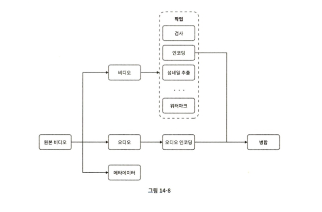
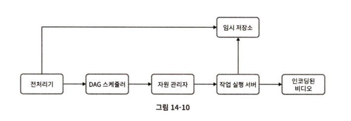
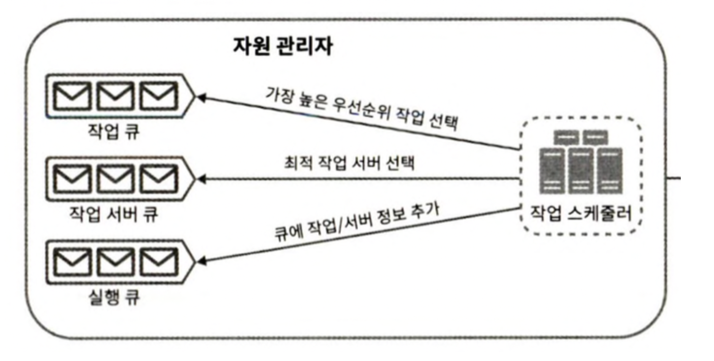

# 유튜브 설계

시스템 설계 면접은 모든 것을 밑바닥부터 만드는 것과는 관계가 없다. 주어진 시간 안에 적절한 기술을 골라 설계를 마치는 것이 더 중요하다. -> CDN, BLOB 스토리지 등 기존 클라우드 서비스 활용하기

### 주요 컴포넌트
- 단말
- CDN : 비디오가 저장되는 곳
- API 서버 : 비디오 스트리밍을 제외한 모든 요청을 처리

### 업로드 절차
두 개의 프로세스가 병렬 처리된다. 
    
    1. 비디오 업로드
        - 비디오를 원본 저장소에 업로드
        - 트랜스 코딩 서버가 트랜스코딩 시작
        - 트랜스 코딩 완료 후
            1) 완료된 비디오를 트랜스코딩 비디오 저장소로 업로드 -> CDN에 올린다
            2) 트랜스코딩 완료 이벤트를 완료 큐에 넣음 -> 완료 핸들러가 이벤트를 꺼내서 메타데이터 갱신
        - API 서버가 단말에 비디오 업로드가 끝났음을 알림

    2. 비디오 메타데이터(비디오 URL, 크기, 해상도, 포맷, 사용자 정보 등) 갱신
        - 업로드되는 동안, 단말은 병렬적으로 비디오 메타데이터 갱신 요청을 API 서버에 보낸다

### 스트리밍 절차
- 다운로드 != 스트리밍 (= 원격지의 비디오로부터 지속적으로 비디오 스트림을 전송받아 영상을 재생하는 것)

- 스트리밍 프로토콜 : 비디오 스트리밍을 위해 데이터를 전송할 때 쓰이는 표준화된 통신방법 (예시 : MPEG-DASH, 애플 HLS 등) 각 프로토콜마다 지원하는 비디오 인코딩이 다르고 플레이어도 다르기 때문에 서비스에 따라 프로토콜을 잘 골라야 한다. 

- 비디오는 CDN에서 바로 스트리밍된다. 사용자의 단말에 가장 가까운 CDN 에지 서버가 비디오 전송을 담당하므로, 전송지연은 낮다. 

### 비디오 트랜스 코딩
다른 단말에서도 재생되려면 다른 단말과 호환되는 비트레이트와 포맷으로 저장되어야 한다. 
- 비트레이트 : 비디오를 구성하는 비트가 얼마나 빨리 처리되어야 하는지를 나타내는 단위
- 인코딩 포맷
    - 컨테이너(비디오 파일, 오디오, 메타데이터를 담는 바구니, 예시 : avi, mp4)
    - 코덱(압축 및 압축 해제 알고리즘)

비디오 트랜스 코딩이 중요한 이유 
- 원본 비디오는 저장 공간을 많이 차지한다. 
- 단말과 브라우저는 특정 종류의 비디오 포맷만 지원하므로, 여러 포맷으로 인코딩해두어야 한다. 
- 끊김없는 재생을 위해, 대역폭에 따라 고화질, 저화질 비디오를 보낼 수 있어야 한다. 

### 유향 비순환 그래프 모델(DAG)
각기 다른 유형의 비디오 프로세싱 파이프라인을 지원하는 한편 처리 과정의 병렬성을 높이기 위해 

-> 작업을 단계별로 배열하여 순차적 또는 병렬적으로 실행될 수 있도록 한다.

### 비디오 트랜스코딩 아키텍처

전처리기
- 비디오 분할 : 비디오 스트림을 GOP 단위로 쪼갠다. 독립적으로 재생 가능하며 보통 몇 초 정도
- DAG 생성 : 설정 파일에 따라 DAG를 만든다. 
- 데이터 캐시 : GOP와 메타데이터를 임시 저장소에 저장. 

DAG 스케줄러 : DAG 그래프를 몇 단계로 분할한 다음 작업 큐에 집어넣는다. 

자원 관리자 : 자원 배분을 효과적으로 수행하는 역할을 담당한다. 세 개의 큐와 작업 스케줄러로 구성된다. 
- 작업 큐 : 실행할 작업이 보관되어 있는 우선순위 큐
- 작업 서버 큐 : 작업 서버의 가용 상태 정보가 보관되어 있는 우선순위 큐
- 실행 큐 : 현재 실행 중인 작업 및 작업 서버 정보가 보관되어 있는 큐(작업이 끝나면 실행 큐에서 제거)
- 작업 스케줄러 : 작업 / 서버 조합을 골라 수행하도록 지시

작업 서버 : DAG에 정의된 작업을 수행
- 워터마크, 인코딩, 섬네일, 병합 등

임시 저장소 : 비디오 프로세싱이 완료되면 삭제
- 메타데이터는 메참조가 잦고, 크기도 작아서 메모리에 캐시
- 비디오/오디오 데이터는 BLOB 저장소에 둔다. 

### 속도 최적화 : 비디오 병렬 업로드
분할한 GOP를 병렬적으로 업로드하면 빠르게 업로드 가능. 

### 속도 최적화 : 업로드 센터를 사용자 근거리에 지정
업로드 센터를 여러 곳에 둔다.

### 속도 최적화 : 모든 절차를 병렬화
어떤 단계의 결과물은 이전 단계의 결과물을 입력으로 사용하여 만들어진다. 이런 의존성이 있으면 병렬성을 높이기 어렵다. 
=> 메시지 큐를 도입하여, 이전 작업이 끝나기를 기다릴 필요 없이 각각의 큐에 보관된 이벤트를 처리하도록 한다. 

### 안전성 최적화 : pre-signed 업로드 URL
허가받은 사용자만이 올바른 장소에 비디오를 업로드할 수 있도록 하기 위해 pre-signed URL을 이용한다. 

### 안전성 최적화 : 비디오 보호
- 디지털 저작권 관리 (DRM) 시스템 도입
- AES 암호화 : 재생 시에만 복호화한다.
- 워터마크

### 비용 최적화 
CDN은 비싸다. 어떻게 낮출 수 있을까? 
비디오 스트리밍은 롱테일 분포를 따른다. 인기 있는 비디오는 재생이 많고, 나머지는 거의 보는 사람이 없다. 
- 인기 비디오는 CDN을 통해 재생, 다른 비디오는 비디오 서버를 통해 재생
- 특정 지역에서만 인기있는 비디오는 다른 지역에 옮기지 않는다. 
-> 이런 식으로 최적화를 시도하기 전에 시청 패턴을 분석할 수 있다. 

