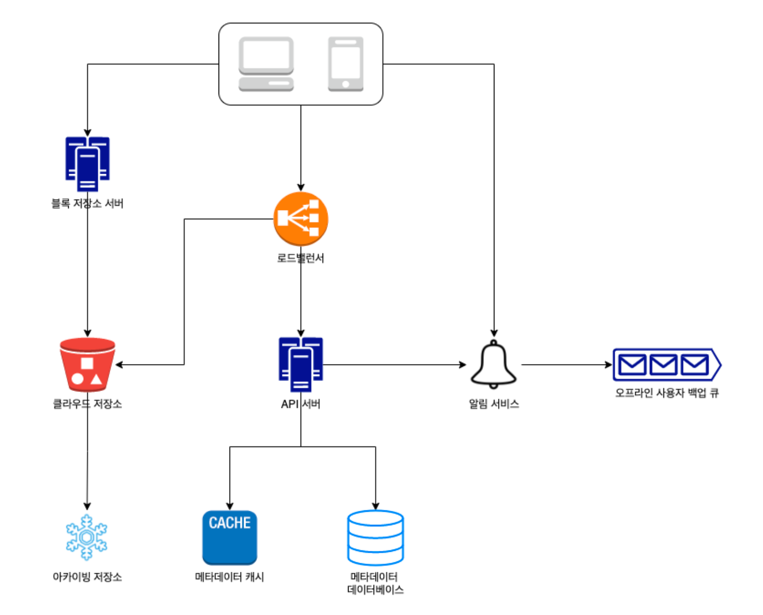

# 구글 드라이브 설계
안정성, 높은 수준의 일관성, 낮은 네트워크 지연, 빠른 동기화가 요구되는 설계

### API
데이터 보호를 위해 HTTPS 프로토콜 사용 & 사용자 인증 필요
1. 파일 업로드 API
- 단순 업로드
- 이어올리기
    - 이어올리기 URL 을 받는다
    - 데이터를 업로드하고 업로드 상태 모니터링
    - 업로드 장애 발생하면 발생시점부터 업로드를 재시작

2. 파일 다운로드 API
3. 파일 갱신 히스토리 API

### 파일 저장소 
S3를 사용하고 여러 지역에 다중화한다. (데이터 무손실 보장)

### 동기화 충돌
두 명 이상의 사용자가 동시에 같은 파일을 업데이트하려고 하는 경우, 
먼저 처리되는 변경은 성공, 나중에 처리되는 변경은 충돌이 발생한 것으로 표시. 두 가지 버전을 합칠지, 하나의 파일로 대체할지 사용자가 결정하게 됨.

### 개략적 설계안

- 블록 저장소 서버 : 파일 블록을 클라우드 저장소에 업로드하는 서버. 각 블록에는 고유한 해시값이 할당되고, 해시값은 메타데이터 디비에 저장된다. 한 블록은 드롭박스의 경우 최대 4MB
- 아카이빙 저장소 : 오랫동안 사용되지 않은 비활성 데이터 저장
- 오프라인 사용자 백업 큐 : 클라이언트가 접속 중이 아닐 때는 이 큐에 파일의 최신 상태에 대한 정보를 저장하고, 접속했을 때 동기화되도록 한다. 

### 블록 저장소 서버 
여기서 파일을 블록 단위로 나누고, 압축하고, 압호화하여, 클라우드 저장소에 전송하는 일을 한다. 
큰 파일들을 업데이트가 일어날 때마다 전체 파일을 서버로 보내면 네트워크 대역폭을 많이 잡아먹게 되므로, 최적화하기 위해 아래의 방법 사용
- 델타 동기화 : 수정이 일어난 부분만 동기화
- 압축

### 높은 일관성 요구사항
같은 파일이 단말이나 사용자에 따라 다르게 보이는 것을 허용할 수 없으므로 최종 일관성이 아닌, 강한 일관성을 보장해야 한다. -> ACID 를 보장하는 관계형 DB를 사용한다. 

### 메타데이터 데이터베이스
- file_version : 파일의 갱신 이력 보관 테이블
- block : 특정 버전의 파일은 파일 블록을 올바른 순서로 조합하기만 하면 복원할 수 있다. 

### 업로드 절차 
사용자가 파일을 업로드하면 두 가지 요청이 병렬적으로 전송된다. 
- 파일 메타데이터 추가
    - 메타데이터를 저장하고, 업로드 상태를 대기로 변경
    - 알림 서비스에 통지
- 파일을 클라우드 저장소에 업로드
    - 블록 저장소 서버에 업로드
    - 클라우드 저장소로 전송, 완료 콜백을 API 서버로 전송
    - 메타데이터 디비에 완료로 변경
    - 알림 서비스에 통지

### 다운로드 절차
- 클라이언트가 접속 중인 경우, 변경이 발생했다고 알려줘서 새 버전을 가져감. (새로운 메타데이터를 통해 블록 다운로드)
- 클라이언트가 접속 중이 아닌 경우, 데이터는 캐시에 보관, 접속하면 그 때 새 버전을 가져감. 

### 알림 서비스
- 롱 폴링 : 클라이언트는 알림 서버와 롱 폴링용 연결을 유지하다가, 특정 파일에 대한 변경을 감지하면 연결을 끊고, 최신 내역을 다운로드한다. 이게 끝나면 다시 롱 폴링 연결을 유지한다. 
- 웹 소켓

-> 롱 폴링을 사용하는 이유
- 채팅 서비스와 달리, 양방향 통신이 필요하지 않다. 서버는 클라이언트에게 알려줘야 하지만, 반대는 필요없다. 

### 저장소 공간 절약
- 중복 제거
- 지능적 백업 전략 : 보관 파일 버전 개수에 제한, 중요 버전만 보관
- 자주 쓰이지 않는 데이터는 아마존S3 클래시어 같은 아카이빙 저장소에 둔다.
